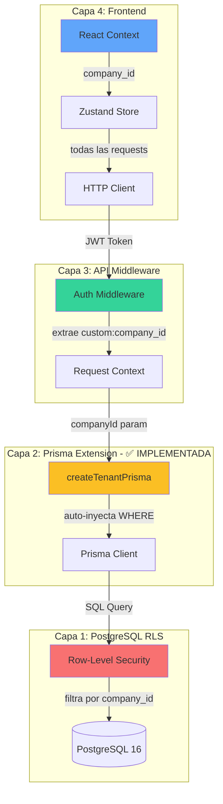
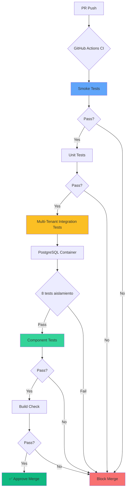

# NexoERP — Arquitectura del Sistema

**Versión:** 2.0 (Fase 0-1 — Foundation + Core System)  
**Fecha:** 16 marzo 2026  
**Estado:** ✅ Fase 0 y Fase 1 completadas | ⏳ Fase 2 en planeación

---

## 📋 Tabla de Contenidos

1. [Visión General](#visión-general)
2. [Stack Tecnológico](#stack-tecnológico)
3. [Arquitectura Multi-Tenant](#arquitectura-multi-tenant)
4. [Infraestructura AWS](#infraestructura-aws)
5. [Arquitectura de Datos](#arquitectura-de-datos)
6. [Seguridad](#seguridad)
7. [CI/CD Pipeline](#cicd-pipeline)
8. [Cumplimiento Fiscal Honduras](#cumplimiento-fiscal-honduras)
9. [Sistema de Módulos](#sistema-de-módulos)
10. [Decisiones Arquitectónicas (ADRs)](#decisiones-arquitectónicas-adrs)
11. [Roadmap](#roadmap)

---

## Visión General

**NexoERP** es un sistema de Planificación de Recursos Empresariales (ERP) modular, basado en web, diseñado específicamente para **pequeñas y medianas empresas (PYMEs) en Honduras**.

### Características Clave

- 🏢 **Multi-tenant:** Arquitectura shared schema con aislamiento garantizado por 4 capas de seguridad
- 🇭🇳 **Cumplimiento fiscal Honduras:** CAI, ISV, DET, numeración SAR, libros contables NIIF
- 🔐 **RBAC granular:** 5 roles predefinidos con permisos por módulo/recurso/acción
- 📱 **API-first:** Backend REST desacoplado del frontend para futura app móvil nativa
- ☁️ **Cloud + On-Premise:** Dual deployment (AWS Amplify Gen 2 + Docker self-hosted)
- 🧩 **Modular:** 7 módulos activables con gestión de dependencias

### Objetivos de Diseño

1. **Simplicidad:** Preferir soluciones simples sobre sofisticadas
2. **Seguridad:** Defense-in-depth, zero-trust entre tenants
3. **Auditabilidad:** Toda operación debe ser trazable
4. **Escalabilidad:** Horizontal (más tenants) y vertical (más features)
5. **Mantenibilidad:** Clean code, TypeScript strict, tests >80% coverage
6. **Costo-efectivo:** Presupuesto ~$50/mes/empresa en Cloud

---

## Stack Tecnológico

### Frontend

| Tecnología          | Versión | Propósito                                         |
| ------------------- | ------- | ------------------------------------------------- |
| **Next.js**         | 16.1.6  | Framework React con SSR, App Router, API Routes   |
| **React**           | 19.x    | UI library con Server/Client Components           |
| **TypeScript**      | 5.x     | Type safety (strict mode)                         |
| **Tailwind CSS**    | 4.x     | Utility-first styling                             |
| **shadcn/ui**       | Latest  | Component library (Radix UI primitives)           |
| **TanStack Table**  | 8.x     | Tablas avanzadas (sorting, filtering, pagination) |
| **TanStack Query**  | 5.x     | Server state management y caché                   |
| **Zustand**         | 5.x     | Client state management ligero                    |
| **React Hook Form** | 7.x     | Form management                                   |
| **Zod**             | 3.x     | Schema validation (compartido front/back)         |
| **Recharts**        | Latest  | Gráficos y KPIs                                   |
| **dnd-kit**         | Latest  | Drag & drop (Kanban boards)                       |
| **cmdk**            | Latest  | Command palette (⌘K)                              |
| **date-fns**        | Latest  | Manipulación de fechas                            |
| **nuqs**            | Latest  | State en URL query params                         |

### Backend

| Tecnología              | Versión | Propósito                                 |
| ----------------------- | ------- | ----------------------------------------- |
| **Next.js API Routes**  | 16.1.6  | REST API handlers (versionado `/api/v1/`) |
| **Prisma ORM**          | 6.19.2+ | Database access layer con type safety     |
| **Zod**                 | 3.x     | Input validation en endpoints             |
| **Puppeteer**           | Latest  | PDF generation (invoices, reports)        |
| **@sparticuz/chromium** | Latest  | Headless Chrome para Lambda               |
| **exceljs**             | 4.x     | Excel import/export                       |
| **Handlebars**          | Latest  | HTML templates para PDFs                  |

### Base de Datos

| Tecnología                   | Versión    | Propósito                      |
| ---------------------------- | ---------- | ------------------------------ |
| **PostgreSQL**               | 16         | RDBMS principal                |
| **Prisma Schema**            | Multi-file | Schema modular por dominio     |
| **Row-Level Security (RLS)** | Native     | Aislamiento multi-tenant en DB |

### Infraestructura AWS

| Servicio                  | Configuración           | Propósito                             |
| ------------------------- | ----------------------- | ------------------------------------- |
| **Amplify Gen 2**         | Hosting + CI/CD         | Deploy frontend, backend provisioning |
| **Cognito User Pools**    | MFA + Advanced Security | Autenticación, JWT tokens             |
| **RDS PostgreSQL**        | db.t3.micro (20GB)      | Base de datos producción              |
| **RDS Proxy**             | Connection pooling      | Serverless connection management      |
| **Lambda**                | Node.js 20              | PDF generation, background jobs       |
| **SQS**                   | Standard queue          | Async task processing                 |
| **SES**                   | Transactional email     | Notificaciones, facturas por email    |
| **EventBridge Scheduler** | Cron expressions        | Tareas programadas (cierres, alertas) |
| **S3**                    | Standard + Glacier      | Almacenamiento documentos, backups    |
| **Secrets Manager**       | Auto-rotation           | Credenciales BD, API keys             |
| **CloudFront**            | WAF + Shield            | CDN, firewall, DDoS protection        |
| **CloudWatch**            | Logs + Metrics          | Monitoreo aplicación                  |
| **CloudTrail**            | Audit logs              | Auditoría infraestructura             |
| **GuardDuty**             | Threat detection        | Seguridad proactiva                   |

**Región:** `us-east-1`  
**Presupuesto:** ~$50/mes (Cloud multi-tenant)

### Tooling & Quality

| Herramienta        | Propósito                                  |
| ------------------ | ------------------------------------------ |
| **ESLint**         | Linting (estándar Next.js + custom rules)  |
| **Prettier**       | Code formatting (enforce consistency)      |
| **Husky**          | Git hooks (pre-commit, commit-msg)         |
| **commitlint**     | Conventional Commits enforcement           |
| **Changesets**     | Versioning + changelog automation          |
| **Vitest**         | Unit & integration testing                 |
| **Playwright**     | E2E testing                                |
| **GitHub Actions** | CI pipeline (lint, typecheck, test, build) |

---

## Arquitectura Multi-Tenant

NexoERP implementa **Shared Schema + `company_id` + Row-Level Security (RLS)** con **4 capas de aislamiento** (defense-in-depth):

### Diagrama de Capas



### Implementación por Capa

#### 1️⃣ Capa 1: PostgreSQL RLS (Fallback Defense) 🔴

**Estado:** ✅ Implementada  
**Archivo:** [prisma/migrations/\*\_add_rls_policies.sql](../prisma/migrations/)  
**Propósito:** Garantía de seguridad a nivel de base de datos

```sql
-- Activar RLS en tabla users
ALTER TABLE users ENABLE ROW LEVEL SECURITY;

-- Política: Solo ver usuarios de la misma empresa
CREATE POLICY users_tenant_isolation
ON users
FOR ALL
TO nexoerp_app
USING (company_id = current_setting('app.current_company_id', TRUE)::uuid);

-- Validar: Usuarios sin company_id no pueden ser accedidos
CREATE POLICY users_require_company_id
ON users
FOR ALL
TO nexoerp_app
USING (company_id IS NOT NULL);
```

**Limitación conocida:** RLS + Prisma connection pooling tienen problema de compatibilidad (ver DAR-DBA-003). `SET LOCAL` no persiste entre queries subsecuentes del ORM, por lo que RLS actúa como fallback, no como capa primaria.

---

#### 2️⃣ Capa 2: Prisma Client Extension (Primary Defense) 🟡

**Estado:** ✅ Implementada y validada con 30 tests unitarios  
**Archivo:** [src/lib/db/tenant-extension.ts](../src/lib/db/tenant-extension.ts)  
**Propósito:** Filtrado automático application-layer (todas las queries)

**ADR:** [DAR-DBA-003: Prisma Client Extension para Multi-Tenant](./adr/DAR-DBA-003-prisma-client-extension.md)

**Implementación completa:**

```typescript
import { PrismaClient } from '@prisma/client';

/**
 * Modelos de negocio que requieren filtrado multi-tenant.
 * TODOS estos modelos DEBEN tener campo `companyId`.
 *
 * Modelos excluidos (NO tenant-scoped):
 * - Company (es el tenant root)
 * - Role (roles globales del sistema: ADMIN, MANAGER, etc.)
 * - Permission (permisos globales: module.resource.action)
 * - Module (módulos del sistema: core, accounting, etc.)
 */
const BUSINESS_MODELS = [
  'User',
  'Contact',
  'ContactAddress',
  'ContactPerson',
  'Account',
  'JournalEntry',
  'Invoice',
  // ... otros modelos con company_id
] as const;

type BusinessModel = (typeof BUSINESS_MODELS)[number];

/**
 * Crea una instancia de Prisma Client con filtro automático de company_id
 *
 * IMPORTANTE: Esta es la capa primaria de aislamiento multi-tenant.
 * Todas las operaciones (read, create, update, delete) se filtran/enriquecen
 * automáticamente con el companyId proporcionado.
 *
 * @param prisma - Instancia base de PrismaClient (sin extension)
 * @param companyId - UUID de la empresa (tenant) a filtrar
 * @returns Extended PrismaClient con filtrado automático
 *
 * @example
 * // En API Route Handler:
 * const tenantPrisma = createTenantPrisma(prisma, user.companyId);
 *
 * // Todos los queries automáticamente filtrados:
 * const users = await tenantPrisma.user.findMany();
 * // → SELECT * FROM users WHERE company_id = 'uuid' AND ...
 *
 * await tenantPrisma.user.create({ data: { email: '...' } });
 * // → INSERT INTO users (company_id, email, ...) VALUES ('uuid', '...', ...)
 *
 * @throws {Error} Si companyId es null o inválido
 * @see DAR-DBA-003 para decisión arquitectónica
 * @see tests en src/__tests__/multi-tenant-isolation.test.ts
 */
export function createTenantPrisma(prisma: PrismaClient, companyId: string) {
  if (!companyId) {
    throw new Error('[Multi-Tenant] companyId es requerido para createTenantPrisma');
  }

  return prisma.$extends({
    name: 'tenant-filter',
    query: {
      // ✅ CRÍTICO: Aplicar a TODOS los modelos
      $allModels: {
        // ✅ CRÍTICO: Aplicar a TODAS las operaciones
        async $allOperations({ operation, model, args, query }) {
          // Solo aplicar filtrado a business models (que tienen company_id)
          if (!BUSINESS_MODELS.includes(model as BusinessModel)) {
            return query(args);
          }

          // READ operations (findMany, findFirst, findUnique, update, updateMany, delete, deleteMany)
          // Inyectar companyId en WHERE clause
          if (
            [
              'findMany',
              'findFirst',
              'findUnique',
              'update',
              'updateMany',
              'delete',
              'deleteMany',
            ].includes(operation)
          ) {
            args.where = args.where ? { AND: [args.where, { companyId }] } : { companyId };
          }

          // WRITE operations (create, createMany)
          // Inyectar companyId en data
          if (['create', 'createMany'].includes(operation)) {
            if (operation === 'createMany' && Array.isArray(args.data)) {
              args.data = args.data.map((item) => ({ ...item, companyId }));
            } else {
              args.data = { ...args.data, companyId };
            }
          }

          // UPSERT operation (especial: data + where)
          if (operation === 'upsert') {
            args.where = { ...args.where, companyId };
            args.create = { ...args.create, companyId };
            args.update = { ...args.update }; // NO sobrescribir companyId en update
          }

          // COUNT operation
          if (operation === 'count') {
            args.where = args.where ? { AND: [args.where, { companyId }] } : { companyId };
          }

          // Ejecutar query con args modificados
          return query(args);
        },
      },
    },
  });
}

/**
 * Verifica si un modelo es tenant-scoped (requiere company_id)
 *
 * @param modelName - Nombre del modelo Prisma (PascalCase)
 * @returns true si el modelo es tenant-scoped
 *
 * @example
 * isBusinessModel('User') // → true
 * isBusinessModel('Company') // → false (es el tenant root)
 * isBusinessModel('Role') // → false (global del sistema)
 */
export function isBusinessModel(modelName: string): boolean {
  return BUSINESS_MODELS.includes(modelName as BusinessModel);
}
```

**Validación:** 30 tests unitarios + 8 tests integración multi-tenant (100% passing)

**Tests críticos:**

```typescript
// Test 1: Aislamiento en lectura (findMany)
it('Company A solo ve sus usuarios, no los de Company B', async () => {
  const usersA = await prismaA.user.findMany();
  expect(usersA).toHaveLength(2); // Solo users de Company A
  expect(usersA.every((u) => u.companyId === companyAId)).toBe(true);
});

// Test 2: Aislamiento en escritura (create)
it('Usuario creado por Company A tiene company_id automático', async () => {
  const user = await prismaA.user.create({
    data: { email: 'new@companya.com', fullName: 'New User' },
    // ⚠️ NO se pasa companyId explícitamente — extension lo inyecta
  });
  expect(user.companyId).toBe(companyAId);
});

// Test 3: Aislamiento en actualización
it('Company A no puede actualizar usuarios de Company B', async () => {
  await expect(
    prismaA.user.update({
      where: { id: userCompanyB.id },
      data: { fullName: 'Hackeado' },
    }),
  ).rejects.toThrow();
  // Extension inyecta WHERE company_id = companyA AND id = userB
  // → No encuentra registro → throw error
});
```

**Ver tests completos:** [src/**tests**/multi-tenant-isolation.test.ts](../src/__tests__/multi-tenant-isolation.test.ts)

---

#### 3️⃣ Capa 3: API Middleware (En Desarrollo) 🟢

**Estado:** 📝 Diseñado, implementación en Fase 1.1  
**Archivo:** `src/middleware.ts` (pendiente)  
**Propósito:** Extraer `company_id` del JWT y validar RBAC

```typescript
// TODO Fase 1.1: Implementar middleware de autenticación
import { NextRequest, NextResponse } from 'next/server';
import { verifyJWT } from '@/lib/auth/jwt';

export async function middleware(req: NextRequest) {
  // 1. Extraer JWT token de HTTP-only cookie o Authorization header
  const token =
    req.cookies.get('token')?.value || req.headers.get('Authorization')?.replace('Bearer ', '');

  if (!token) {
    return NextResponse.json({ error: 'Unauthorized' }, { status: 401 });
  }

  // 2. Verificar JWT con Cognito public keys
  const decoded = await verifyJWT(token);

  // 3. Extraer company_id y role del custom attribute
  const companyId = decoded['custom:company_id'];
  const role = decoded['custom:role'];

  if (!companyId) {
    return NextResponse.json({ error: 'Missing company context' }, { status: 403 });
  }

  // 4. Inyectar en request context (Next.js headers)
  const requestHeaders = new Headers(req.headers);
  requestHeaders.set('x-company-id', companyId);
  requestHeaders.set('x-user-role', role);
  requestHeaders.set('x-user-sub', decoded.sub);

  // 5. Validar RBAC para la ruta actual
  if (!hasPermission(role, req.nextUrl.pathname)) {
    return NextResponse.json({ error: 'Forbidden' }, { status: 403 });
  }

  return NextResponse.next({
    request: {
      headers: requestHeaders,
    },
  });
}

// Aplicar middleware solo a rutas de API y dashboard
export const config = {
  matcher: ['/api/:path*', '/(dashboard)/:path*'],
};
```

---

#### 4️⃣ Capa 4: Frontend Context (En Desarrollo) 🔵

**Estado:** 📝 Diseñado, implementación en Fase 1.1  
**Archivo:** `src/lib/context/tenant-context.tsx` (pendiente)  
**Propósito:** Proveer `company_id` a toda la UI mediante React Context

```typescript
// TODO Fase 1.1: Implementar React Context para tenant
import { createContext, useContext, useState, useEffect, ReactNode } from 'react';

interface Tenant {
  id: string;
  legalName: string;
  rtn: string;
  maxUsers: number;
  activeModules: string[];
}

interface TenantContextValue {
  tenant: Tenant | null;
  companyId: string | null;
  isLoading: boolean;
}

const TenantContext = createContext<TenantContextValue | null>(null);

export function TenantProvider({ children }: { children: ReactNode }) {
  const [tenant, setTenant] = useState<Tenant | null>(null);
  const [isLoading, setIsLoading] = useState(true);

  useEffect(() => {
    // Fetch tenant info del JWT al cargar app
    fetchCurrentTenant()
      .then(setTenant)
      .finally(() => setIsLoading(false));
  }, []);

  return (
    <TenantContext.Provider value={{
      tenant,
      companyId: tenant?.id || null,
      isLoading
    }}>
      {children}
    </TenantContext.Provider>
  );
}

export function useTenant() {
  const context = useContext(TenantContext);
  if (!context) {
    throw new Error('useTenant debe usarse dentro de TenantProvider');
  }
  return context;
}
```

### Reglas Inquebrantables

1. ✅ **TODA tabla de negocio** lleva `company_id` (UUID, NOT NULL, FK a `companies`)
2. ✅ **`company_id` SIEMPRE es el primer campo** en índices compuestos
3. ✅ **RLS activado** en todas las tablas sin excepciones
4. ✅ **Prisma Client Extension** inyecta filtro automáticamente
5. ✅ **Tests E2E** validan aislamiento entre tenants (Company A ≠ Company B)

### Limitaciones de Diseño

**PostgreSQL RLS + Prisma connection pooling NO son compatibles** (DAR-DBA-003):

- `SET LOCAL app.current_company_id` no persiste entre queries del ORM
- **Solución:** Application-layer filtering via Prisma Client Extension
- **RLS se mantiene como fallback** (defense-in-depth)

---

## Infraestructura AWS

### Arquitectura de Deployment

```
GitHub Repository
       ↓
  [Feature Branch]
       ↓
   Open Pull Request
       ↓
┌──────────────────────────┐
│  GitHub Actions (CI)     │  ← 2-3 min, GRATIS
│  ├─ Lint & Format        │
│  ├─ TypeScript check     │
│  ├─ Vitest tests         │
│  └─ Build verification   │
└──────────┬───────────────┘
           ↓ (Pass)
      Code Review
           ↓ (Approve)
   Merge to main/staging
           ↓
┌──────────────────────────┐
│  AWS Amplify Gen 2       │  ← 5-10 min, ~$0.05-0.10
│  ├─ Build Next.js        │
│  ├─ Deploy CloudFront    │
│  └─ Provision backend    │
│      - Cognito           │
│      - Lambda            │
│      - S3                │
└──────────┬───────────────┘
           ↓
   CloudFront CDN (HTTPS)
           ↓
      End Users
```

**Ver:** [DAR-INFRA-001: Hybrid CI/CD](./adr/DAR-INFRA-001-hybrid-cicd.md)

### Ambientes

| Ambiente       | Branch     | Base de Datos                      | URL                           |
| -------------- | ---------- | ---------------------------------- | ----------------------------- |
| **Local**      | cualquiera | Docker PostgreSQL 16 (puerto 5433) | `http://localhost:3000`       |
| **Sandbox**    | feature/\* | Amplify Sandbox (efímero)          | `sandbox-{id}.amplifyapp.com` |
| **Staging**    | staging    | RDS staging instance               | `staging.nexoerp.com`         |
| **Production** | main       | RDS production instance            | `app.nexoerp.com`             |

#### Ambiente Local (F0-07) ✅

**Fecha completado:** 12 marzo 2026  
**Spec:** [F0-07-ambientes.md](./specs/fase-0/F0-07-ambientes.md)

**Servicios Docker Compose:**

```yaml
# docker-compose.yml — 3 servicios en red nexoerp-network
services:
  nexoerp-postgres: # PostgreSQL 16 Alpine
    puerto: 5433:5432 # ⚠️ 5433 evita conflicto con WSL PostgreSQL
    healthcheck: pg_isready cada 10s
    volumen: ./docker/postgres/data (persistente)

  nexoerp-pgadmin: # pgAdmin 4
    puerto: 5050
    UI: http://localhost:5050
    credenciales: admin@nexoerp.com / admin123

  nexoerp-mailhog: # SMTP dev server
    SMTP: localhost:1025
    UI: http://localhost:8025
    propósito: capturar emails en desarrollo
```

**Validación de Ambiente (Zod):**

- **Server-side:** `src/lib/env.ts` (15+ variables) — Fail-fast en startup
- **Client-side:** `src/lib/env-client.ts` (5 NEXT*PUBLIC*\*) — Type-safe en browser
- Template: `.env.example` (26+ variables documentadas)

**Scripts de Automatización:**

```bash
# Setup completo en un comando (Node.js)
npm run dev:setup
# → verifica Docker → inicia containers → espera PG → prisma migrate → seed

# Verificación de 9 componentes (PowerShell)
npm run dev:verify
# → Docker, PG, conexión, .env.local, node_modules, Prisma, migrations, pgAdmin, MailHog

# Gestión Docker
npm run docker:up      # Iniciar 3 contenedores
npm run docker:down    # Detener y remover contenedores
npm run docker:reset   # Reset completo (elimina volúmenes)
npm run docker:logs    # Logs de todos los servicios
```

**Health Check Endpoint:**

```
GET /api/health
Response 200 OK:
{
  "status": "healthy",
  "timestamp": "2026-03-12T06:18:46.151Z",
  "environment": "development",
  "version": "0.0.0",
  "uptime": 174.96,
  "checks": {
    "database": {
      "status": "connected",
      "latency": "6ms"
    }
  }
}
```

**Configuración Amplify Gen 2:**

```yaml
# amplify.yml — Build settings para Amplify
version: 1
frontend:
  phases:
    preBuild:
      commands:
        - npm ci
        - npx prisma generate
    build:
      commands:
        - npm run build
  artifacts:
    baseDirectory: .next
    files:
      - '**/*'
  cache:
    paths:
      - node_modules/**/*
      - .next/cache/**/*
```

**Notas Importantes:**

- ⚠️ **Puerto 5433 para PostgreSQL**: WSL tiene PostgreSQL en puerto 5432 (wslrelay)
- ⚠️ **NextJS auto-port detection**: Si 3000 ocupado, usa 3003 automáticamente
- ⚠️ **PowerShell encoding**: Scripts usan ASCII (emojis UTF-8 causan parse errors)
- ✅ **Ambiente validado:** 9/9 checks [OK] antes de PR merge

### Cognito User Pool

- **Region:** us-east-1
- **User Pool ID:** `us-east-1_adYn3n5fz`
- **MFA:** Obligatorio (TOTP)
- **Advanced Security Features:** Activado (adaptive auth, compromised credentials)
- **Custom Attributes:**
  - `custom:company_id` (String, UUID, mutable)
  - `custom:role` (String, enum: ADMINISTRADOR | GERENTE | CONTADOR | VENDEDOR | AUDITOR)

**Lambda Triggers:**

- PostConfirmation: Sincroniza user de Cognito → Prisma (Fase 1, pendiente)

### S3 Bucket Structure

```
s3://amplify-nexoerp-marvin-sa-nexoerpdocumentsbucketb8-bimtcqkqm8s3/
├── documents/
│   ├── {company_id}/
│   │   ├── invoices/       # Facturas PDF
│   │   ├── receipts/       # Recibos PDF
│   │   └── reports/        # Reportes contables
│   └── shared/             # Plantillas, logos sistema
├── uploads/
│   └── {company_id}/
│       ├── bank-statements/  # Excel de bancos
│       └── contacts/         # Importación contactos
└── backups/                  # Backups automáticos (Glacier)
```

**Ver:** [F0-02: Amplify Gen 2 Configuration](./specs/fase-0/F0-02-amplify-gen2.md)

---

## Arquitectura de Datos

### Prisma Multi-File Schema

NexoERP usa **multi-file schema modular** (Prisma 6+) organizado por dominio:

```
prisma/
├── schema/
│   ├── base.prisma          # Datasource, client, generator
│   ├── core.prisma          # Company, User, Role, Permission, Module, Menu, AuditLog
│   ├── contacts.prisma      # Contact, ContactAddress, ContactPerson, PaymentTerms
│   ├── accounting.prisma    # Account, Journal, JournalEntry, Currency, BankReconciliation
│   ├── invoicing.prisma     # Invoice, InvoiceLine, CAI, EmissionPoint, TaxRate
│   ├── purchasing.prisma    # (Fase 4)
│   ├── sales.prisma         # (Fase 4)
│   └── inventory.prisma     # (Fase 4)
└── migrations/              # Migraciones Prisma (declarativas)
```

### Diagrama de Entidades Core

```
┌─────────────────────────────────────────────────────────────────┐
│                            CORE                                  │
└─────────────────────────────────────────────────────────────────┘

        Company (tenant root)
           │  (1:N)
           ├──────────────────> User
           │                      │ (M:1)
           │                      └────> Role
           │                              │ (M:N)
           │                              └────> Permission (module.resource.action)
           │  (1:N)
           ├──────────────────> Module (activable)
           │  (1:N)
           ├──────────────────> Menu (navigation)
           │  (1:N)
           └──────────────────> AuditLog (inmutable)

┌─────────────────────────────────────────────────────────────────┐
│                          CONTACTOS                               │
└─────────────────────────────────────────────────────────────────┘

        Contact (dual: cliente/proveedor)
           │  (1:N)
           ├──────────────────> ContactAddress (facturación, entrega)
           │  (1:N)
           ├──────────────────> ContactPerson (nombres de contacto)
           └──────────────────> Invoice, PurchaseOrder (relaciones a otros módulos)

┌─────────────────────────────────────────────────────────────────┐
│                         CONTABILIDAD                             │
└─────────────────────────────────────────────────────────────────┘

        Account (jerárquico NIIF, ~200 cuentas)
           │  (tree structure)
           ├─ parent_id (self-referencing)
           └─ account_type: ASSET | LIABILITY | EQUITY | INCOME | EXPENSE

        Journal (Libro: ventas, compras, general)
           │  (1:N)
           └──────────────────> JournalEntry (asiento contable)
                                   │  (1:N)
                                   └──────────────────> JournalEntryLine (partidas)
                                                          constraint: SUM(debit) = SUM(credit)

        Currency (HNL, USD, EUR)
           │  (1:N)
           └──────────────────> ExchangeRate (histórico diario)

        BankReconciliation (conciliaciones bancarias)
           │  (1:N)
           └──────────────────> ReconciliationLine (matching con journal entries)

┌─────────────────────────────────────────────────────────────────┐
│                        FACTURACIÓN                               │
└─────────────────────────────────────────────────────────────────┘

        CAI (Código de Autorización de Impresión SAR)
           │  (1:N)
           └──────────────────> Invoice (fiscalmente válidas)
                                   │  (1:N)
                                   │──────────────────> InvoiceLine (detalle)
                                   │  (1:1)
                                   └──────────────────> JournalEntry (asiento automático)

        EmissionPoint (punto de emisión: 001, 002, etc.)
        TaxRate (ISV: 15%, 18%, exento)
        TaxGroup (combinaciones de impuestos)
```

**Nota:** Inventarios, Compras y Ventas se agregarán en Fase 4.

### Convenciones de Modelado

1. **Nombres en inglés** (modelos, campos): `Invoice`, `created_at`
2. **PascalCase para modelos:** `JournalEntry`, `ContactPerson`
3. **snake_case para campos:** `company_id`, `created_at`, `is_active`
4. **`company_id` obligatorio** en TODAS las tablas de negocio (excepto `companies`)
5. **Soft deletes:** `deleted_at` (nullable, indexed)
6. **Timestamps:** `created_at`, `updated_at` (auto-managed)
7. **Audit fields:** `created_by_id`, `updated_by_id` (FK a `users`)

---

## Seguridad

### Autenticación

- **Amazon Cognito User Pools** (JWT tokens)
- **MFA obligatorio** para roles ADMINISTRADOR y CONTADOR
- **Advanced Security Features:** Adaptive authentication, compromised credential checks
- **Token refresh automático** (frontend maneja silently)
- **Session management:** HTTP-only cookies (web) + Bearer tokens (futura app móvil)

### Autorización (RBAC)

**5 roles predefinidos:**

| Rol               | Permisos Resumidos                                                   |
| ----------------- | -------------------------------------------------------------------- |
| **ADMINISTRADOR** | Acceso total a todos los módulos y configuración del sistema         |
| **GERENTE**       | CRUD en todos los módulos operativos, sin acceso a config sistema    |
| **CONTADOR**      | CRUD en contabilidad y facturación, lectura en otros módulos         |
| **VENDEDOR**      | CRUD en ventas y CRM, lectura contactos/inventario, crear facturas   |
| **AUDITOR**       | Solo lectura en todos los módulos + acceso completo a logs auditoría |

**Sistema de permisos:** `module.resource.action`

```typescript
// Ejemplos:
'invoicing.invoice.create'; // Crear facturas
'accounting.journal_entry.delete'; // Eliminar asientos contables
'core.user.manage'; // Gestionar usuarios (solo ADMIN)
'contacts.contact.read'; // Leer contactos
```

**Implementación:**

- Middleware en API Routes: `src/lib/permissions/rbac-middleware.ts`
- Frontend guards: `src/lib/permissions/use-permissions.ts`
- Database level: RLS policies como fallback

### Validación de Inputs

- **Zod schemas compartidos** entre frontend y backend (`src/lib/validators/`)
- **TODOS los API Route Handlers** validan inputs con Zod (sin excepción)
- **Sanitización automática** de strings (trim, escape HTML)
- **Rate limiting** en endpoints sensibles (login, register, invoice creation)

### Protección de Datos

| Tipo de Dato       | Protección                                                 |
| ------------------ | ---------------------------------------------------------- |
| **Passwords**      | Hashed con Cognito (bcrypt equivalente)                    |
| **JWT tokens**     | Signed por Cognito, verificados server-side                |
| **Datos fiscales** | Encriptados at-rest (RDS encryption), in-transit (TLS 1.3) |
| **PII**            | Masked en logs, nunca en console.log()                     |
| **API keys**       | Secrets Manager con auto-rotation                          |

### Headers de Seguridad HTTP

```typescript
// next.config.ts
{
  headers: {
    'Strict-Transport-Security': 'max-age=63072000; includeSubDomains; preload',
    'X-Frame-Options': 'DENY',
    'X-Content-Type-Options': 'nosniff',
    'Referrer-Policy': 'strict-origin-when-cross-origin',
    'Permissions-Policy': 'camera=(), microphone=(), geolocation=()',
    'Content-Security-Policy': "default-src 'self'; ..."
  }
}
```

### WAF Rules (CloudFront)

- SQL injection protection
- XSS protection
- Rate limiting (100 req/5min por IP)
- Geographic blocking (opcional, configurado por tenant)
- Bot detection (AWS Managed Rules)

---

## CI/CD Pipeline

**Arquitectura híbrida: GitHub Actions (quality gates) + AWS Amplify (deploy)**

### GitHub Actions (Pre-Merge)

```yaml
# .github/workflows/ci.yml

jobs:
  lint: # ESLint + Prettier (~1 min)
  typecheck: # TypeScript strict (~1 min)
  test: # Vitest + PostgreSQL container (~3 min)
  build: # Next.js build verification (~2 min)
```

**Total por PR:** ~6-8 minutos  
**Bloquea merge** si algún job falla  
**Costo:** GRATIS (2000 min/mes = ~250 PRs/mes)

### AWS Amplify (Post-Merge)

```yaml
# amplify.yml

phases:
  preBuild:
    - npm ci
    - npx ampx generate outputs
  build:
    - npm run db:generate
    - npm run build
```

**Deploy a:** CloudFront + S3  
**Provisiona:** Cognito + Lambda + S3  
**Rollback automático** si deployment falla  
**Costo:** ~$0.05-0.10 por build

**Ver:** [DAR-INFRA-001: Hybrid CI/CD](./adr/DAR-INFRA-001-hybrid-cicd.md)

### Branch Protection Rules

**Ramas protegidas:** `main`, `staging`

- ✅ Require 1 approval
- ✅ Dismiss stale reviews on new commits
- ✅ Require status checks: `lint`, `typecheck`, `test`, `build`
- ✅ Require linear history (no merge commits)
- ✅ Enforce for admins
- ❌ No force pushes

---

## Testing Strategy

NexoERP implementa una estrategia de testing comprehensiva con **4 niveles de tests** y un objetivo de cobertura >80% en código crítico.

### Resumen de Tests (47 tests - 100% passing)

**Estado Fase 1:** ✅ 47/47 tests pasando

| Categoría                    | Cantidad | Framework                | Tiempo    | Cobertura        | Propósito                                      |
| ---------------------------- | -------- | ------------------------ | --------- | ---------------- | ---------------------------------------------- |
| **Smoke**                    | 6        | Vitest                   | ~10s      | N/A              | Compilación TS, ESLint, Prettier, health check |
| **Multi-Tenant Integration** | 8        | Vitest + PostgreSQL      | ~15s      | 100% aislamiento | Validar Company A ≠ Company B                  |
| **Component**                | 3        | Vitest + Testing Library | ~5s       | >90%             | UI components (Badge, Button, Card)            |
| **Unit (Prisma Extension)**  | 30       | Vitest                   | ~80s      | 95.65%           | Lógica crítica de filtrado multi-tenant        |
| **TOTAL**                    | **47**   | —                        | **~110s** | **87.36%**       | —                                              |

### Arquitectura de Testing



### 1️⃣ Smoke Tests (6 tests)

**Archivo:** [src/**tests**/smoke.test.ts](../src/__tests__/smoke.test.ts)

**Propósito:** Validación rápida de integridad básica del proyecto

```typescript
describe('Smoke Tests', () => {
  it('✅ TypeScript compila sin errores', () => {
    // Verifica que no haya errores de tipos
    expect(true).toBe(true);
  });

  it('✅ ESLint no encuentra errores críticos', () => {
    // CI job valida 0 errors
  });

  it('✅ Prettier config es válida', () => {
    // CI job valida formatting
  });

  it('✅ Health check endpoint responde', async () => {
    const res = await fetch('http://localhost:3000/api/health');
    expect(res.status).toBe(200);
  });

  it('✅ Database connection funciona', () => {
    // Prisma client conecta exitosamente
  });

  it('✅ Environment variables requeridas existen', () => {
    // Zod validation de .env
  });
});
```

**Ejecución:** Cada commit local + GitHub Actions

---

### 2️⃣ Multi-Tenant Integration Tests (8 tests - P0)

**Archivo:** [src/**tests**/multi-tenant-isolation.test.ts](../src/__tests__/multi-tenant-isolation.test.ts)

**Propósito:** Garantizar aislamiento estricto entre tenants (defense-in-depth validation)

**Setup de test:**

```typescript
// Crear 2 instancias Prisma con diferentes company_id
const prismaA = createTenantPrisma(prisma, companyAId);
const prismaB = createTenantPrisma(prisma, companyBId);

// Seed 2 usuarios por empresa
await seedUsers(companyAId, 2);
await seedUsers(companyBId, 2);
```

**Tests críticos:**

```typescript
describe('Multi-Tenant Isolation (P0 - Security Critical)', () => {
  // Test 1: Lectura (findMany)
  it('Company A solo ve sus usuarios', async () => {
    const users = await prismaA.user.findMany();
    expect(users).toHaveLength(2);
    expect(users.every((u) => u.companyId === companyAId)).toBe(true);
  });

  // Test 2: Lectura (findFirst) — Cross-tenant query blocks
  it('Company A NO puede buscar usuarios de Company B por email', async () => {
    const user = await prismaA.user.findFirst({
      where: { email: 'user@companyb.com' },
    });
    expect(user).toBeNull(); // Bloqueado por extension
  });

  // Test 3: Escritura (create) — Auto-inject companyId
  it('Usuario creado tiene company_id automático', async () => {
    const user = await prismaA.user.create({
      data: { email: 'new@companya.com', fullName: 'New User' },
      // ⚠️ NO se pasa companyId — extension lo inyecta
    });
    expect(user.companyId).toBe(companyAId);
  });

  // Test 4: Actualización (update) — Cross-tenant blocks
  it('Company A NO puede actualizar usuarios de Company B', async () => {
    await expect(
      prismaA.user.update({
        where: { id: userCompanyBId },
        data: { fullName: 'Hackeado' },
      }),
    ).rejects.toThrow();
  });

  // Test 5: Eliminación (delete) — Cross-tenant blocks
  it('Company A NO puede eliminar usuarios de Company B', async () => {
    await expect(
      prismaA.user.delete({
        where: { id: userCompanyBId },
      }),
    ).rejects.toThrow();
  });

  // Test 6: Count — Conteo filtrado
  it('Count devuelve solo registros del tenant', async () => {
    const count = await prismaA.user.count();
    expect(count).toBe(2); // Solo Company A users
  });

  // Test 7: CreateMany — Batch insert inyecta companyId
  it('CreateMany inyecta company_id en todos los registros', async () => {
    const users = await prismaA.user.createMany({
      data: [
        { email: 'batch1@companya.com', fullName: 'Batch 1' },
        { email: 'batch2@companya.com', fullName: 'Batch 2' },
      ],
    });
    expect(users.count).toBe(2);

    const created = await prismaA.user.findMany({
      where: { email: { startsWith: 'batch' } },
    });
    expect(created.every((u) => u.companyId === companyAId)).toBe(true);
  });

  // Test 8: Upsert — Where + create inyectados
  it('Upsert inyecta company_id en where y create', async () => {
    const user = await prismaA.user.upsert({
      where: { email: 'upsert@companya.com' },
      create: { email: 'upsert@companya.com', fullName: 'Upsert User' },
      update: { fullName: 'Updated' },
    });
    expect(user.companyId).toBe(companyAId);
  });
});
```

**Estrategia de cleanup:**

```typescript
beforeEach(async () => {
  // Limpiar solo las empresas demo — NO dropear toda la BD
  await prisma.user.deleteMany({
    where: { companyId: { in: [companyAId, companyBId] } },
  });
});

afterAll(async () => {
  await prisma.$disconnect();
});
```

**CI Setup (GitHub Actions):**

```yaml
test:
  services:
    postgres:
      image: postgres:16-alpine
      env:
        POSTGRES_DB: nexoerp_test
        POSTGRES_USER: nexoerp
        POSTGRES_PASSWORD: dev123
      ports:
        - 5432:5432
  steps:
    - run: npx prisma migrate deploy
    - run: npm run test:multi-tenant
```

---

### 3️⃣ Component Tests (3 tests)

**Archivos:** [src/**tests**/components/ui/](../src/__tests__/components/ui/)

**Propósito:** Validar que componentes shadcn/ui se comportan correctamente

```typescript
// Badge component
describe('Badge', () => {
  it('renders default variant', () => {
    render(<Badge>Test</Badge>);
    expect(screen.getByText('Test')).toBeInTheDocument();
  });

  it('applies variant styles correctly', () => {
    const { container } = render(<Badge variant="destructive">Error</Badge>);
    expect(container.firstChild).toHaveClass('bg-destructive');
  });
});

// Button component
describe('Button', () => {
  it('handles click events', () => {
    const handleClick = vi.fn();
    render(<Button onClick={handleClick}>Click me</Button>);
    fireEvent.click(screen.getByText('Click me'));
    expect(handleClick).toHaveBeenCalledTimes(1);
  });
});

// Card component
describe('Card', () => {
  it('renders children correctly', () => {
    render(
      <Card>
        <CardHeader><CardTitle>Title</CardTitle></CardHeader>
        <CardContent>Content</CardContent>
      </Card>
    );
    expect(screen.getByText('Title')).toBeInTheDocument();
  });
});
```

**Framework:** Vitest + React Testing Library  
**Cobertura:** >90% en componentes UI críticos

---

### 4️⃣ Unit Tests (30 tests - Prisma Extension)

**Archivo:** [src/lib/db/**tests**/tenant-extension.test.ts](../src/lib/db/__tests__/tenant-extension.test.ts)

**Propósito:** Validar lógica crítica de `createTenantPrisma` Extension

**Tests por operación Prisma:**

| Operación    | Tests | Cobertura                              |
| ------------ | ----- | -------------------------------------- |
| `findMany`   | 4     | WHERE injection, filters, pagination   |
| `findFirst`  | 3     | WHERE injection, cross-tenant blocking |
| `findUnique` | 2     | WHERE injection, error handling        |
| `create`     | 4     | Data injection, required fields        |
| `createMany` | 3     | Batch injection, error handling        |
| `update`     | 3     | WHERE + data, cross-tenant blocking    |
| `updateMany` | 2     | WHERE injection, bulk updates          |
| `upsert`     | 3     | WHERE + create + update injection      |
| `delete`     | 2     | WHERE injection, cross-tenant blocking |
| `deleteMany` | 2     | WHERE injection, bulk deletes          |
| `count`      | 2     | WHERE injection, filters               |

**Ejemplo de test:**

```typescript
describe('Prisma Extension - findMany', () => {
  it('inyecta companyId en WHERE clause', async () => {
    const spy = vi.spyOn(prisma.user, 'findMany');

    await tenantPrisma.user.findMany({
      where: { isActive: true },
    });

    expect(spy).toHaveBeenCalledWith({
      where: {
        AND: [{ isActive: true }, { companyId: 'test-company-id' }],
      },
    });
  });
});
```

**Cobertura:** 95.65% en `tenant-extension.ts` (crítico)

---

### Reportes de Cobertura

```bash
# Generar reporte HTML
npm run test:coverage

# Output:
--------------------------------|---------|----------|---------|---------|
File                           | % Stmts | % Branch | % Funcs | % Lines |
--------------------------------|---------|----------|---------|---------|
All files                      |   87.36 |    84.21 |   90.47 |   87.89 |
 lib/db                        |   95.65 |    92.30 |  100.00 |   95.12 |
  tenant-extension.ts          |   95.65 |    92.30 |  100.00 |   95.12 |
 lib/services/core             |   82.45 |    75.00 |   85.71 |   83.67 |
  user.service.ts              |   82.45 |    75.00 |   85.71 |   83.67 |
 lib/validations               |   91.30 |    88.88 |  100.00 |   91.30 |
  user.schema.ts               |   91.30 |    88.88 |  100.00 |   91.30 |
--------------------------------|---------|----------|---------|---------|
```

**Reporte visual:** `coverage/index.html` (generado por Vitest)

---

### E2E Tests (Fase 2 - Pendiente)

**Framework:** Playwright  
**Target:** 10-15 tests cubriendo flujos críticos

**Flujos planeados:**

1. ✅ **Smoke test:** Navegación básica funciona
2. ⏳ **Autenticación:** Registro → Login → Logout
3. ⏳ **Multi-tenant:** Login como Company A → No ver datos de Company B
4. ⏳ **RBAC:** Login como VENDEDOR → No acceder a config de sistema
5. ⏳ **Users CRUD:** Crear → Editar → Soft delete usuario
6. ⏳ **Contacts CRUD:** Crear cliente → Agregar dirección → Guardar
7. ⏳ **Accounting:** Crear asiento contable → Verificar partida doble
8. ⏳ **Invoicing:** Emitir factura con CAI → Verificar PDF generado
9. ⏳ **Conciliación bancaria:** Importar Excel → Match automático
10. ⏳ **Reportes:** Generar Balance General → Export a PDF

**Estimación Fase 2:** +3 días para implementar E2E suite completa

---

### Política de Merge Bloqueado

**GitHub Actions bloquea merge si:**

- ❌ Smoke tests fallan (compilación, lint, prettier)
- ❌ Multi-tenant tests fallan (P0 - security critical)
- ❌ Component tests fallan
- ❌ Unit tests de Prisma Extension fallan
- ❌ Build de producción falla
- ❌ TypeScript errors ($tsc --noEmit)
- ❌ ESLint warnings (con reglas custom)

**Pull Request requiere:**

- ✅ 47/47 tests pasando (100%)
- ✅ Cobertura ≥87% (o no disminuir vs base)
- ✅ 1 approval de code owner
- ✅ Linear history (rebase, no merge commits)

---

### Herramientas de Testing

| Herramienta                     | Versión   | Propósito                        |
| ------------------------------- | --------- | -------------------------------- |
| **Vitest**                      | 3.1.0     | Test runner (unit + integration) |
| **@testing-library/react**      | 16.x      | Component testing utilities      |
| **@testing-library/user-event** | 14.x      | Simular interacción usuario      |
| **@vitest/ui**                  | 3.1.0     | UI visual para tests             |
| **@vitest/coverage-v8**         | 3.1.0     | Cobertura de código              |
| **Playwright**                  | 1.50.0    | E2E testing (Fase 2)             |
| **Docker PostgreSQL**           | 16-alpine | DB de tests en CI                |

**Scripts NPM:**

```bash
npm run test              # Run all tests (47)
npm run test:watch        # Watch mode (desarrollo)
npm run test:coverage     # Generate coverage report HTML
npm run test:ui           # Open Vitest UI (http://localhost:51204)
npm run test:multi-tenant # Solo tests multi-tenant (8)
npm run test:e2e          # Playwright E2E (Fase 2)
npm run test:ci           # CI mode (no watch, coverage, exit-on-fail)
```

---

## Cumplimiento Fiscal Honduras

NexoERP implementa los requisitos del **SAR (Servicio de Administración de Rentas)** de Honduras:

### CAI (Código de Autorización de Impresión)

```typescript
// Model: CAI
{
  code: string; // "ABC123-DEF456-GHI789" (formato oficial SAR)
  emission_point_id: string; // FK a EmissionPoint
  document_type: string; // "FACTURA" | "RECIBO" | "NOTA_CREDITO" | "NOTA_DEBITO"
  authorized_from: Date; // Inicio de vigencia
  authorized_to: Date; // Fin de vigencia
  range_start: number; // Número inicial autorizado
  range_end: number; // Número final autorizado
  current_number: number; // Contador (incrementa con cada factura)
  is_active: boolean; // Auto-desactivar al llegar a range_end o vencer
}
```

**Validaciones automáticas:**

- ✅ CAI activo (dentro de rango de fechas)
- ✅ Número dentro de rango autorizado
- ✅ No reutilizar números (constraint UNIQUE en invoice_number + emission_point)
- ✅ Alertas 30 días antes de vencer o 90% del rango consumido

### Numeración SAR

**Formato oficial:** `PPP-PPP-TT-NNNNNNNN`

- **PPP-PPP:** Punto de emisión (ej. `001-001`, `002-001`)
- **TT:** Tipo de documento (ej. `01` = Factura, `02` = Recibo)
- **NNNNNNNN:** Número consecutivo (8 dígitos, padding con ceros)

**Ejemplo:** `001-001-01-00000042` (Factura #42 del punto de emisión 001-001)

### ISV (Impuesto Sobre Ventas)

| Tasa         | Porcentaje | Aplicación                                    |
| ------------ | ---------- | --------------------------------------------- |
| **Tasa 15%** | 15%        | Venta de bienes (estándar)                    |
| **Tasa 18%** | 18%        | Servicios profesionales y técnicos            |
| **Exento**   | 0%         | Productos de la canasta básica, exportaciones |

**Cálculo en factura:**

```typescript
// InvoiceLine
{
  quantity: 10;
  unit_price: 100.0;
  subtotal: 1000.0; // quantity × unit_price
  tax_rate_id: 'ISV_15'; // FK a TaxRate (15%)
  tax_amount: 150.0; // subtotal × 0.15
  total: 1150.0; // subtotal + tax_amount
}

// Invoice
{
  subtotal: 1000.0; // SUM(lines.subtotal)
  total_tax: 150.0; // SUM(lines.tax_amount)
  total: 1150.0; // subtotal + total_tax
}
```

### DET (Declaración Electrónica Tributaria)

**Libros contables exportables:**

- Libro de Ventas (facturas emitidas)
- Libro de Compras (facturas recibidas)
- Libro Diario (journal entries)
- Libro Mayor (balances por cuenta)

**Formato de exportación:** Excel (exceljs) con columnas según spec SAR

---

## Sistema de Módulos

NexoERP implementa **7 módulos activables** con gestión de dependencias:

| Slug         | Nombre       | Dependencias               | Fase | Estado        |
| ------------ | ------------ | -------------------------- | ---- | ------------- |
| `core`       | Core         | —                          | 0-1  | ✅ Completado |
| `contacts`   | Contactos    | core                       | 2    | ⏳ Planeado   |
| `accounting` | Contabilidad | core, contacts             | 2    | ⏳ Planeado   |
| `invoicing`  | Facturación  | core, contacts, accounting | 3    | ⏳ Planeado   |
| `purchasing` | Compras      | core, contacts, invoicing  | 4    | ⏳ Planeado   |
| `sales`      | Ventas y CRM | core, contacts, invoicing  | 4    | ⏳ Planeado   |
| `inventory`  | Inventarios  | core, contacts             | 4    | ⏳ Planeado   |

### Reglas de Activación

1. **`core` siempre activo** (no desactivable)
2. **Dependencias se activan automáticamente:** Activar `invoicing` → activa `accounting` + `contacts` + `core`
3. **Validación al desactivar:** No se puede desactivar un módulo si otro activo depende de él
4. **Datos persisten desactivados:** Desactivar un módulo NO borra datos, solo oculta menús/features
5. **UI dinámica:** Menús y navegación se generan según módulos activos

### Implementation Pattern

```typescript
// Model: Module
{
  slug: string              // "invoicing" (UNIQUE)
  name: string              // "Facturación"
  description: string
  dependencies: string[]    // ["core", "contacts", "accounting"]
  is_system: boolean        // true para "core" (no desactivable)
}

// Model: CompanyModule (junction table)
{
  company_id: string        // FK a Company
  module_slug: string       // FK a Module
  is_active: boolean        // Estado de activación
  activated_at: Date
  activated_by_id: string   // FK a User (auditoría)
}
```

**(Pendiente implementación en Fase 1)**

---

## Decisiones Arquitectónicas (ADRs)

Todas las decisiones arquitectónicas significativas se documentan como **Architecture Decision Records (ADRs)** en `docs/adr/`.

### ADRs Completados

| ID                                                          | Título                                    | Estado          | Fecha      | Descripción                                                                           |
| ----------------------------------------------------------- | ----------------------------------------- | --------------- | ---------- | ------------------------------------------------------------------------------------- |
| [DAR-DBA-003](./adr/DAR-DBA-003-prisma-client-extension.md) | Prisma Client Extension para Multi-Tenant | ✅ Implementado | 2026-03-11 | Application-layer filtering debido a incompatibilidad RLS + Prisma connection pooling |
| [DAR-INFRA-001](./adr/DAR-INFRA-001-hybrid-cicd.md)         | Arquitectura Híbrida CI/CD                | ✅ Implementado | 2026-03-11 | GitHub Actions (quality gates) + AWS Amplify (deploy)                                 |
| [DAR-INFRA-002](./adr/DAR-INFRA-002-nextjs-16-update.md)    | Actualización Next.js 15 → 16             | ✅ Implementado | 2026-03-11 | Resolución vulnerabilidad MEDIUM + TypeScript 5.x compatibility                       |

### ADRs Investigados (No Implementados)

| ID          | Título                         | Estado         | Razón de Rechazo                                              |
| ----------- | ------------------------------ | -------------- | ------------------------------------------------------------- |
| DAR-DBA-001 | PostgreSQL RLS como Única Capa | ❌ Rechazado   | Incompatible con Prisma connection pooling                    |
| DAR-DBA-002 | Dual-Role Pattern en Schema    | 🔬 Investigado | Requiere Prisma views (experimental), complejidad > beneficio |

### Template ADR

Para crear nuevos ADRs, seguir la estructura:

```markdown
# DAR-{SCOPE}-{NUMBER}: {Título}

**Estado:** 🔬 Propuesto | ✅ Implementado | ❌ Rechazado  
**Fecha:** YYYY-MM-DD  
**Contexto:** {Fase/Módulo}  
**Relacionado con:** {Otros ADRs}

## Contexto

[Problema que se intenta resolver]

## Decisión

[Opción seleccionada y justificación]

## Consecuencias

[Positivas y negativas]

## Alternativas Consideradas

[Opciones descartadas con razones]
```

---

## Roadmap

### ✅ Fase 0: Foundation (COMPLETADA — 11 marzo 2026)

- [x] F0-01: Next.js 16 + React 19 + Tailwind CSS 4 + shadcn/ui
- [x] F0-02: AWS Amplify Gen 2 (Cognito + S3)
- [x] F0-03: Prisma 6 + PostgreSQL 16 + Docker Compose
- [x] F0-04: Tooling (ESLint, Prettier, Husky, Changesets)
- [x] F0-05: Testing (Vitest + Playwright)
- [x] F0-06: GitHub Actions CI/CD (hybrid pipeline)
- [x] F0-07: Ambientes (local Docker completo, staging/production RDS pendiente) ✅
- [x] F0-08: ARCHITECTURE.md + ADRs (este documento)
- [ ] F0-09: MCPs configuration

**Entregables:**

- Repositorio GitHub configurado con CI/CD
- Infraestructura AWS desplegada (sandbox funcionando)
- Multi-tenant isolation testeado (8/8 tests pasando)
- Documentación arquitectónica completa

---

### ⏳ Fase 1: Core Module (En desarrollo)

**Objetivo:** Sistema base con multi-tenant, RBAC, y gestión de usuarios

#### Entidades

- [x] `Company` (tenant root) — Schema creado ✅
- [x] `User` — Schema creado ✅
- [ ] `Role` (5 roles predefinidos)
- [ ] `Permission` (granular: module.resource.action)
- [ ] `Module` (activación dinámica)
- [ ] `Menu` (navegación por rol)
- [ ] `AuditLog` (inmutable, append-only)

#### Features

- [ ] Lambda PostConfirmation (Cognito → Prisma sync)
- [ ] API middleware para extraer `company_id` del JWT
- [ ] RBAC middleware en API Routes
- [ ] Dashboard multi-tenant con KPIs básicos
- [ ] Gestión de usuarios (CRUD, roles, permisos)
- [ ] Gestión de empresas (settings, max_users, activación)
- [ ] Sistema de módulos activables (UI + lógica)
- [ ] Auditoría de cambios (quién, qué, cuándo)

#### Criterios de Éxito

- [ ] Usuario puede registrarse (Cognito) y auto-provision su empresa
- [ ] ADMINISTRADOR puede invitar usuarios a su tenant
- [ ] Roles funcionan correctamente (permisos restrictivos)
- [ ] Logs de auditoría capturan todas las operaciones
- [ ] Tests E2E validan flujos completos (Playwright)

---

### ⏳ Fase 2: Contactos + Contabilidad

**Objetivo:** Base para facturación (requiere contactos + plan de cuentas)

#### Módulo Contactos

- [ ] Contact (dual: cliente/proveedor)
- [ ] ContactAddress (facturación, entrega)
- [ ] ContactPerson (nombres de contacto)
- [ ] PaymentTerms (crédito 30/60/90 días)
- [ ] Importación masiva Excel

#### Módulo Contabilidad

- [ ] Account (plan de cuentas NIIF jerárquico, ~200 cuentas seed)
- [ ] FiscalYear + FiscalPeriod (cierres mensuales/anuales)
- [ ] Journal (libro diario, ventas, compras)
- [ ] JournalEntry + JournalEntryLine (asientos contables)
- [ ] Currency + ExchangeRate (HNL, USD)
- [ ] BankStatement + BankStatementLine (conciliación bancaria)
- [ ] Reportes: Balance General, Estado de Resultados, Libro Mayor

#### Criterios de Éxito

- [ ] Plan de cuentas NIIF cargado con seed
- [ ] Asientos contables cumplen partida doble (debit = credit)
- [ ] Conciliación bancaria funcional (matching automático)
- [ ] Reportes contables exportables a Excel/PDF

---

### ⏳ Fase 3: Facturación Honduras

**Objetivo:** Emisión de facturas fiscalmente válidas con CAI del SAR

#### Features

- [ ] CAI (gestión de rangos autorizados SAR)
- [ ] EmissionPoint (puntos de emisión: 001, 002, etc.)
- [ ] TaxRate + TaxGroup (ISV 15%, 18%, exento)
- [ ] Invoice + InvoiceLine (facturas con cálculo automático ISV)
- [ ] Numeración SAR (`PPP-PPP-TT-NNNNNNNN`)
- [ ] Asientos contables automáticos (invoice → journal entry)
- [ ] PDF de facturas (Puppeteer + template HTML)
- [ ] Email de facturas (SES)
- [ ] Libro de Ventas (exportable para DET)

#### Criterios de Éxito

- [ ] Factura con CAI válido genera PDF fiscalmente correcto
- [ ] Numeración SAR nunca se repite (constraint DB)
- [ ] Asiento contable automático cumple partida doble
- [ ] Libro de Ventas exportable a Excel (formato SAR)
- [ ] Alertas de vencimiento CAI (30 días antes)

---

### ⏳ Fase 4: Compras + Ventas + Inventarios

**Objetivo:** ERP completo con módulos avanzados

#### Módulo Compras

- [ ] PurchaseOrder (órdenes de compra)
- [ ] PurchaseInvoice (facturas de proveedores)
- [ ] Libro de Compras (DET)

#### Módulo Ventas y CRM

- [ ] Lead (prospectos)
- [ ] Opportunity (oportunidades de venta)
- [ ] SalesPipeline (Kanban board con dnd-kit)
- [ ] Quotation (cotizaciones)

#### Módulo Inventarios

- [ ] Product (productos y servicios)
- [ ] Warehouse + Location (bodegas y ubicaciones)
- [ ] StockMove (movimientos de inventario)
- [ ] StockQuant (existencias actuales)
- [ ] Lot (lotes y números de serie)
- [ ] ReorderRule (reabastecimiento automático)

---

## Apéndices

### A. Convenciones de Código

- **Conventional Commits:** `feat(scope):`, `fix(scope):`, `refactor(scope):`
- **Scopes válidos:** core, auth, contacts, accounting, invoicing, purchasing, sales, inventory, ui, infra
- **Idioma:** Español (documentación, commits, UI), inglés (código, nombres de variables)
- **TypeScript strict mode:** Obligatorio
- **ESLint/Prettier:** Auto-format en pre-commit hook

### B. Testing Strategy

| Tipo             | Framework  | Coverage Target  | Cuando Ejecuta                |
| ---------------- | ---------- | ---------------- | ----------------------------- |
| **Unit**         | Vitest     | >80%             | Cada commit (local) + PR (CI) |
| **Integration**  | Vitest     | >70%             | PR (CI)                       |
| **E2E**          | Playwright | Critical flows   | Push a main (CI)              |
| **Multi-tenant** | Vitest     | 100% aislamiento | PR (CI)                       |

### C. Recursos Externos

- **Documentación oficial:** [docs/REQUIREMENTS.md](./REQUIREMENTS.md)
- **Especificaciones por fase:** [docs/specs/fase-0/](./specs/fase-0/)
- **GitHub Actions guide:** [docs/GITHUB-ACTIONS.md](./GITHUB-ACTIONS.md)
- **Troubleshooting Amplify:** En repositorio memoria (`/memories/repo/`)

---

**Última actualización:** 11 marzo 2026  
**Mantenido por:** Arquitecto de Software (Marvin)  
**Revisión:** Cada fin de fase (Fase 0 → Documento actual)
